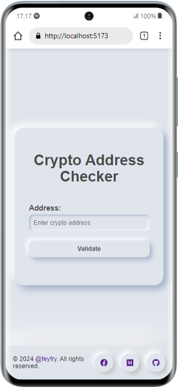
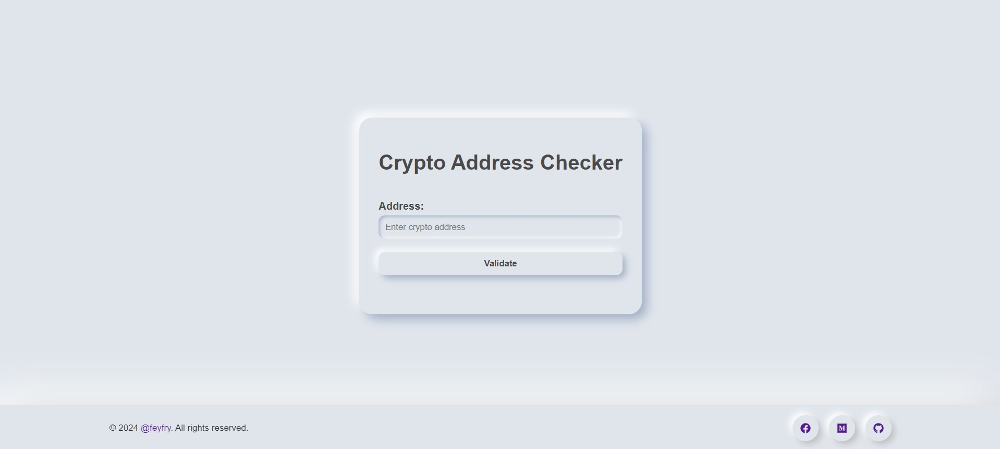

## Tampilan Aplikasi





# Proyek React dan Rust

Panduan instalasi untuk proyek ini, termasuk langkah-langkah untuk frontend (React) dan backend (Rust).

## Prerequisites

Sebelum memulai, pastikan Anda memiliki:

- [Node.js](https://nodejs.org/) (v14 atau lebih baru) untuk frontend
- [Rust](https://www.rust-lang.org/tools/install) dan [Cargo](https://doc.rust-lang.org/cargo/) untuk backend

## Instalasi dan Menjalankan Proyek

1. Clone repository
2. Buka Terminal, masuk ke direktori proyek

### Frontend (React)

```bash
cd frontend
npm install
npm run dev
```

### Backend (Rust)

```bash
cd backend
cargo build
cargo run
```

3. Buka http://localhost:5173 di browser untuk mengakses aplikasi React.

## Catatan Penting
- Data yang ditampilkan untuk pemeriksaan alamat mungkin belum optimal dan kurang akurat.
- Implementasi saat ini menggunakan library yang sudah ada dan pola alamat menggunakan regex.
- Tidak menggunakan API eksternal, sehingga keakuratan data perlu dipertimbangkan.
- Hal ini mungkin menjadi keterbatasan saat ini dan area untuk perbaikan di masa depan.

## Happy Trying! 😊
